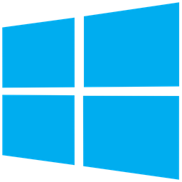

<h1 align="center">
 
 <br />
 Peapod
</h1>
<div align="center">
 
 
 
</div>
<div align="center">
 
 
 
 
</div>

<div align="center">
 Desktop client for <a href="https://www.photopea.com/">Photopea</a>, made for Windows, Linux and MacOS.
 <br />
 https://discord.gg/agQ9mRdHMZ
</div>

## Download

<table align="center">
  <tr>
    <th>
      
    </th>
    <th>
      
    </th>
    <th>
      
    </th>
  </tr>

  <tr>
    <td width="30%">
      <div align="center">
        <a href="https://github.com/SpikeHD/peapod/releases/latest/download/peapod_x86_64-pc-windows-msvc_msi">x86_64</a>
        <span>|</span>
        <a href="https://github.com/SpikeHD/peapod/releases/latest/download/peapod_aarch64-pc-windows-msvc_nsis">ARM</a>
      </div>
    </td>
    <td width="30%">
      <div align="center">
        <a href="https://github.com/SpikeHD/peapod/releases/latest/download/peapod_x86_64-apple-darwin_dmg">x86_64</a>
        <span>|</span>
        <a href="https://github.com/SpikeHD/peapod/releases/latest/download/peapod_aarch64-apple-darwin_dmg">ARM</a>
      </div>
    </td>
    <td width="30%">
      <div align="center">
        <a href="https://github.com/SpikeHD/peapod/releases/latest/download/peapod_x86_64-unknown-linux-gnu_deb">x86_64</a>
        <span>|</span>
        <a href="https://github.com/SpikeHD/peapod/releases/latest/download/">ARM v7</a>
        <span>|</span>
        <a href="https://github.com/SpikeHD/peapod/releases/latest/download/">ARM64</a>
      </div>
    </td>
  </tr>
</table>

> [!NOTE]
> Other releases, such as portable `.zip`/`.tar.gz` downloads, can be found [on the releases page](https://github.com/SpikeHD/peapod/releases/latest)

## Table of Contents

* [Downloads](#download)
* [Features](#features)
* [Building](#building)
  * [Prerequisites](#prerequisites)
  * [Steps](#steps)
* [TODO](#todo)
* [Contributing](#contributing)

## Features

* Small filesize
* Native ARM support
* Various CLI options

## Building

### Prerequisites

* [Node.js](https://nodejs.org/en/)
* [pnpm](https://pnpm.io/)
* [Rust + Cargo](https://www.rust-lang.org/tools/install)

### Steps

1. Clone the repository
  ```sh
  git clone https://github.com/SpikeHD/Peapod.git
  ```
2. Install dependencies
  ```sh
  pnpm install
  ```
3. Build the project
  ```sh
  pnpm build
  ```

## TODO

* Offline mode
* Custom theme support
  * In-UI theme switcher (Maybe possible to insert into `More > Themes`?)
* Plugin support
  * In-UI plugin manager

## Contributing

Issues, PRs, etc. are all welcome!